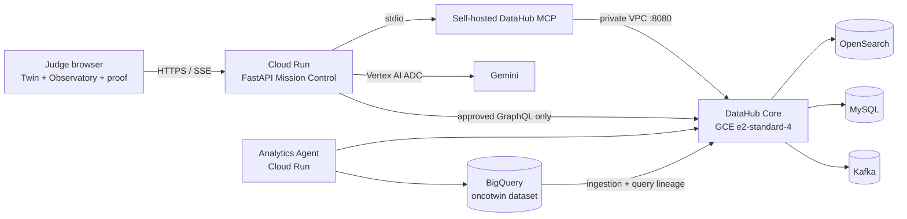

# OncoTwin v9 Architecture

## Runtime topology



The browser never receives a DataHub or Google credential. Cloud Run reaches
DataHub GMS over the private `oncotwin-net` subnet. DataHub's browser UI remains
behind an IAP SSH tunnel.

## Mission state machine

```text
BASELINE
  → DataHub MCP context bundle
  → failure observed
  → upstream/downstream lineage impact
  → RL safety decision
  → metadata-aware repair proposal
  → HUMAN APPROVAL BOUNDARY
  → governed action
  → DataHub/PASS verification
  → immutable replay trace
```

Each event records a sequence number, relative timestamp, responsible agent,
tool, evidence, scene cue and synthetic twin state. The same event updates the
agent map, 3D stage, scRNA cell space, context graph and trust rail.

## DataHub evidence bundle

The live mission opens one self-hosted MCP session and calls:

1. `search`
2. `get_entities`
3. `list_schema_fields`
4. `get_lineage` upstream
5. `get_lineage` downstream
6. `get_dataset_queries` when required by the case

This session reuse avoids repeatedly starting the MCP subprocess and produces a
single auditable context bundle for the RL decision.

## Judge proof path

`GET /api/datahub/proof` is a separate, read-only verification path. Every live
request invokes four MCP tools against the canonical `progression_features` URN
and returns the tool names, timings and response evidence. It also performs a
read-only active-incident check when an admin token is available. The receipt
asserts zero mutations and can be exported from Proof Galaxy as JSON.

The seven 3D worlds are presentation controls, not proof by themselves. Their
proof comes from the receipt and the timestamped mission event trace. This keeps
the visual layer mesmerizing while preserving an auditable distinction between
live DataHub work and research simulation.

The Causal Observatory consumes `/api/datahub/observatory`, which contains the
fresh proof, a browser-safe topology and seven counterfactual scenarios. Green
graph flow is attached to MCP evidence; red propagation and mint recovery are
simulations. The policy membrane and zero-write counter make this boundary
visible without relying on narration.

## RL contract

The deterministic tabular Q-learning controller trains 700 episodes per case.
Its state contains only operational safety signals:

- data trust
- model risk
- null rate
- drift score
- schema compatibility
- synthetic malignant fraction (research visualization signal)
- model/consumer block state

It may block a model, block consumers, flag research review or request a repair.
It cannot recommend a medicine, diagnosis or patient treatment.

## Real operations versus simulation

| Capability | Execution |
|---|---|
| DataHub search/schema/lineage/query inspection | Live in Cloud Run mode |
| Feature Quality incident resolution | Live, operator-approved GraphQL, restricted to `CUSTOM` incidents whose title begins `OncoTwin` |
| Metadata description writeback | Live MCP mutation after single-use proposal approval |
| Six non-live cancer-context recoveries | Digital-twin simulation with no DataHub mutation |
| Verified replay | Read-only; never repeats a mutation |

## Proven data path

```text
gene_expression_summary
  → progression_features
      COALESCE(AVG(MKI67/EPCAM/VIM), 0.0)
  → progression_scores
      model_version = oncotwin-v4-lineage
```

DataHub ingestion publishes schemas, profiles, usage, fine-grained lineage and
available query evidence. The repair is not considered complete until BigQuery
reports zero null signal rows, DataHub re-ingestion succeeds, and DataHub reports
zero active incidents on `progression_features`.
