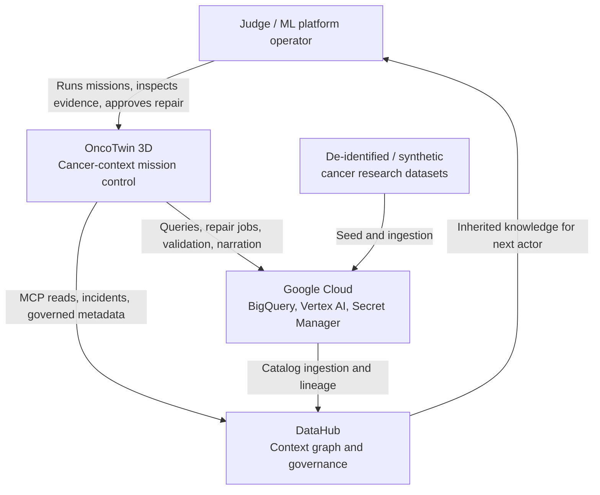
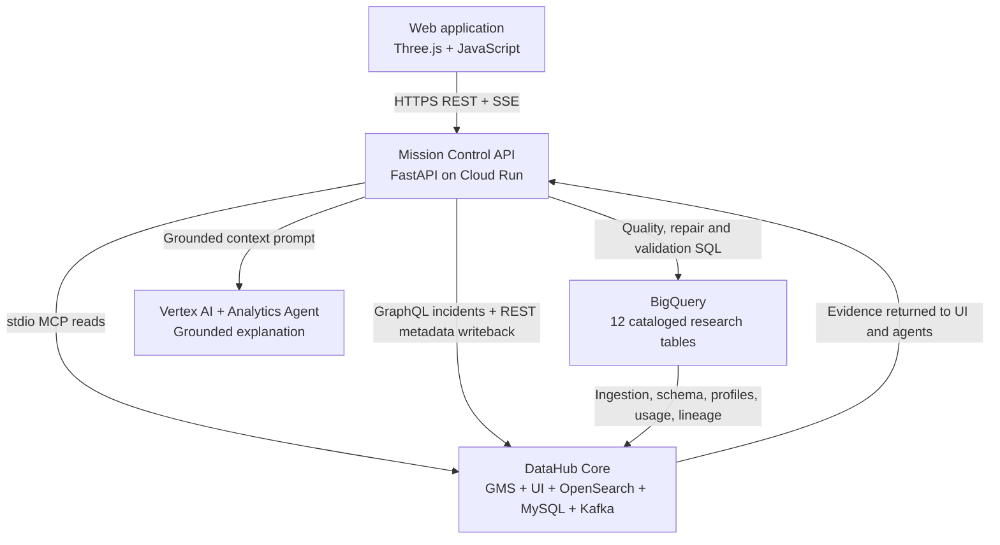
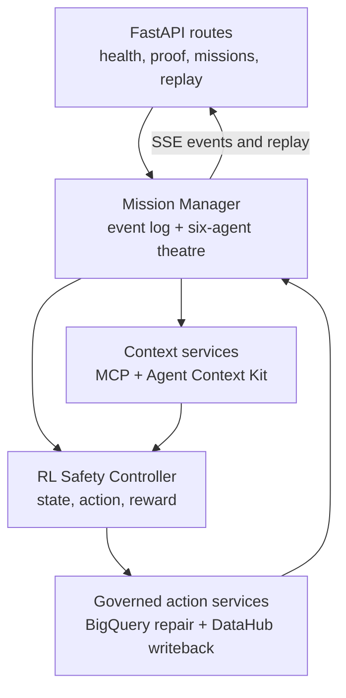
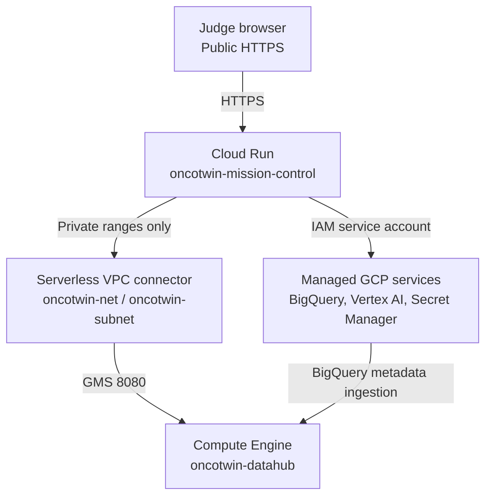
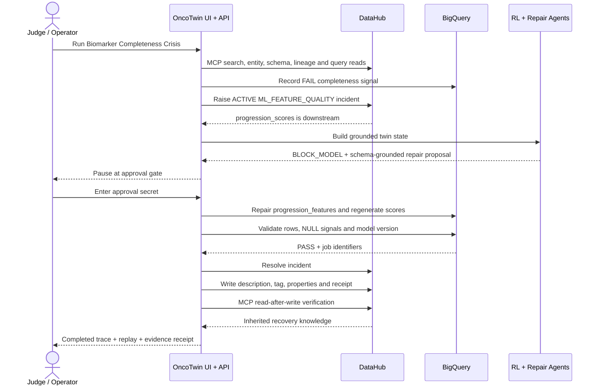
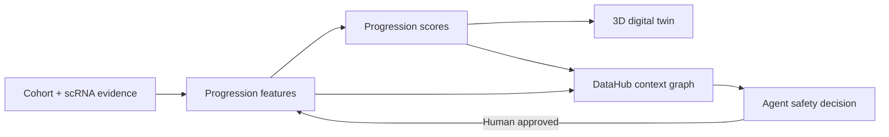

# OncoTwin 3D V10.1 — C4 Architecture and End-to-End Flow

> DataHub-grounded cancer-context digital twins with human-governed repair and inherited agent knowledge.

## 1. Executive architecture summary

OncoTwin 3D is a research-only cancer data and ML reliability control plane. It combines a Three.js digital-twin interface, a FastAPI mission orchestrator, seven reinforcement-learning safety scenarios, BigQuery research telemetry, Vertex AI narration, and a self-hosted DataHub context graph.

DataHub is not a decorative catalog in this system. Before an agent acts, it supplies canonical asset identity, schema, lineage, ownership, quality and query evidence through the self-hosted MCP Server and Agent Context Kit. After human approval, OncoTwin repairs the governed BigQuery feature product, validates it, resolves the DataHub incident, and writes an audit description, tag, timestamp, job identifiers and cryptographic receipt back to DataHub so the next human or agent inherits the recovery knowledge.

The biological measurements and failure scenarios are synthetic. DataHub reads, BigQuery jobs, incident lifecycle, approval gate, metadata writeback and post-write verification are live in production mode.

## 2. C4 Level 1 — System context



### External actors and systems

| Element | Responsibility |
|---|---|
| Judge / operator | Selects a cancer-context mission, watches the agent trace, supplies single-use approval, and validates DataHub evidence. |
| OncoTwin 3D | Turns context into a replayable safety decision and an approval-gated recovery. |
| DataHub | Canonical identity, schemas, lineage, ownership, tags, incidents, queries and persistent recovery knowledge. |
| Google Cloud | Cloud Run hosting, BigQuery processing, Vertex AI narration, Secret Manager approvals and private networking. |
| Research sources | Synthetic or de-identified cohort, scRNA, multi-omic, protein and spatial evidence. No clinical decision-making. |

## 3. C4 Level 2 — Container architecture



### Container responsibilities

| Container | Technology | Main responsibility |
|---|---|---|
| 3D web experience | HTML, CSS, JavaScript, Three.js, GLTF | Live Mission, Cancer Twin, scRNA, Causal Observatory, Proof Galaxy and Generated Fix views. |
| Mission Control API | Python, FastAPI, Uvicorn | API façade, mission lifecycle, event streaming, agent orchestration, approval enforcement and replay. |
| DataHub MCP adapter | `mcp-server-datahub` over stdio | Read-only discovery, entity inspection, schemas, upstream/downstream lineage and query evidence. |
| DataHub Core | DataHub 1.7 on Compute Engine | Context graph, GMS APIs, UI, incidents, metadata, search and persistent inherited knowledge. |
| BigQuery products | Google BigQuery | Research tables, quality signals, approved feature repair, score regeneration and validation. |
| Vertex AI specialist | Gemini 2.5 Flash and LangChain | Narrates only the retrieved DataHub evidence; failures fall back to deterministic evidence summaries. |
| Secret Manager | Google Secret Manager | Stores DataHub read/admin tokens and the human writeback approval secret. |

## 4. C4 Level 3 — Mission Control components



### Internal component mapping

| Component | Primary code | Function |
|---|---|---|
| API façade | `backend/app/main.py` | Serves the UI and exposes health, proof, mission, approval, replay and governance endpoints. |
| Mission orchestration | `backend/app/mission_control.py` | Builds the audit trail, invokes context retrieval, records the failure and pauses before mutation. |
| Condition registry | `backend/app/condition_registry.py` | Maps seven missions to canonical DataHub assets, contracts, owners and expected fields. |
| RL digital twin | `backend/app/rl_simulation.py` | Converts DataHub-grounded state into block, repair, retrain or review actions. |
| MCP context adapter | `backend/app/mcp_client.py` | Opens one self-hosted MCP session and executes the six evidence reads. |
| Agent Context specialist | `backend/app/langchain_specialist.py` | Connects official DataHub context tools to Gemini through LangChain. |
| Repair engine | `backend/app/governed_repair.py` | Runs approved BigQuery repair, regenerates scores and executes quality validation. |
| Incident adapter | `backend/app/datahub_graphql.py` | Raises, queries and resolves DataHub incidents. |
| Knowledge writeback | `backend/app/governed_repair.py` | Persists description, custom properties, `AgentRepaired` tag and receipt through the official DataHub emitter. |
| Metadata-aware code generation | `backend/app/codegen.py` | Produces reviewable SQL, dbt, Airflow or ingestion artifacts after schema and lineage inspection. |
| Grounded narrator | `backend/app/gemini.py` | Produces evidence-bound summaries without inventing metadata. |

## 5. C4 deployment view — Google Cloud



### Deployment details

| Layer | Deployment |
|---|---|
| Frontend and API | One Cloud Run image, 2 vCPU, 2 GiB, autoscaling 0–3 instances. |
| DataHub | `e2-standard-4` Ubuntu VM with Docker Compose, 80 GB balanced disk and 4 GB swap. |
| Network | Cloud Run reaches DataHub GMS over the private VPC; DataHub UI is accessed by an IAP tunnel for evidence capture. |
| Identity | `oncotwin-agent` service account with BigQuery job/data permissions and Secret Manager access. |
| Secrets | Separate version-selectable DataHub read/admin tokens plus a human approval secret. |
| Container supply chain | Cloud Build creates the image and Artifact Registry stores it before Cloud Run deployment. |

## 6. Complete live governed-writeback flow



### Step-by-step control logic

1. The operator selects **Biomarker Completeness Crisis · LIVE DATAHUB**.
2. Context Scout replaces guessed names with the canonical `progression_features` DataHub URN.
3. DataHub MCP returns schema, ownership, tags, upstream lineage, downstream lineage and generating-query evidence.
4. Quality Sentinel writes a synthetic `FAIL` signal to `quality_events` and raises a real active DataHub incident.
5. Lineage Sentinel proves that `progression_scores` is downstream of the failing feature product.
6. ML Guardian converts the metadata into a digital-twin safety state and blocks model consumption.
7. Repair Engineer uses the retrieved schema and contract to generate a `COALESCE`-protected BigQuery repair.
8. The system stops at the governance boundary. No data or metadata mutation is performed without the approval secret.
9. After approval, BigQuery recreates `progression_features`, regenerates `progression_scores`, and records a `PASS` quality event.
10. A separate validation query requires at least one row, zero NULL signal rows and the governed repair model version.
11. Only after validation passes does Governance Steward resolve the DataHub incident.
12. The agent writes an audit description, `AgentRepaired` tag, custom properties, responsible agent, UTC timestamp, repair/validation job IDs and SHA-256 receipt to DataHub.
13. A final MCP `get_entities` call verifies that the next agent can retrieve the inherited knowledge.
14. Every event is streamed to the browser and retained as a verified replay.

## 7. Six-agent collaboration model

| Agent | DataHub capability | Decision or contribution |
|---|---|---|
| Context Scout | MCP search and entity identity | Finds the canonical asset URN and prevents table-name hallucination. |
| Lineage Sentinel | DataHub lineage skill and MCP lineage | Maps upstream provenance and downstream blast radius. |
| ML Guardian | Agent Context Kit + LangChain | Blocks unsafe model consumption using contextual evidence. |
| Bioinformatics Agent | Schema, contract and cohort context | Interprets gene, cell-state, multi-omic and spatial evidence as research telemetry. |
| Repair Engineer | DataHub quality/lineage skills + code generation | Generates schema-compatible SQL and downstream regeneration steps. |
| Governance Steward | Incident API + metadata emitter | Enforces approval, resolves incidents and writes durable audit knowledge. |

## 8. Seven DataHub-native cancer-context twins

| Mission | Canonical DataHub asset | Context used | Governed response |
|---|---|---|---|
| Biomarker Completeness Crisis | `progression_features` | Schema, quality, queries and downstream scores | Live repair, validation, incident resolution and metadata writeback. |
| Tumour-State Progression Surge | `tumour_state_transitions` | Transition schema, provenance and lineage | Block or research review according to trusted transition context. |
| Cancer Cohort Drift | `cohort_drift_metrics` | Model version, population drift schema and query evidence | Retraining gate with governed drift evidence. |
| Genomic Schema Mutation | `genomic_schema_contract_events` | Expected/observed types and downstream dependencies | Generate a compatible migration or pipeline patch for review. |
| Multi-omic Biomarker Discordance | `multi_omic_biomarker_evidence` | RNA, variant, protein concordance and provenance | Quarantine unsupported biomarker claims. |
| Protein Conformation Evidence Rift | `protein_conformation_states` | Sequence version, structure model, confidence and provenance | Prevent untraceable structural evidence from reaching models. |
| Tumour Microenvironment Escape | `spatial_microenvironment_states` | Cell cluster, immune distance, malignant fraction and lineage | Trigger spatial-context review before progression scoring. |

Each mission has a condition-specific DataHub proof receipt consisting of six MCP reads: search, entity, schema, upstream lineage, downstream lineage and dataset queries.

## 9. Data and metadata flow



### Cataloged BigQuery products

- `patient_cohorts`
- `cell_clusters`
- `gene_expression_summary`
- `progression_features`
- `progression_scores`
- `quality_events`
- `tumour_state_transitions`
- `cohort_drift_metrics`
- `genomic_schema_contract_events`
- `multi_omic_biomarker_evidence`
- `protein_conformation_states`
- `spatial_microenvironment_states`

BigQuery ingestion emits schemas, profiles, usage, operations, table lineage, fine-grained lineage and query metadata into DataHub.

## 10. API and interaction flow

| Endpoint | Purpose |
|---|---|
| `GET /api/health` | Version, live/demo state, DataHub URL and capability health. |
| `GET /api/datahub/proof` | Fresh condition-specific MCP evidence and incident count. |
| `GET /api/datahub/observatory` | Topology for the Causal Observatory. |
| `GET /api/missions/cases` | Seven mission definitions. |
| `POST /api/missions/start` | Starts a live mission and raises the feature-quality incident where applicable. |
| `GET /api/missions/{id}/events` | Server-Sent Events for the animated six-agent trace. |
| `POST /api/missions/{id}/approve` | Approval-gated repair, validation, incident resolution and writeback. |
| `GET /api/missions/{id}/replay` | Deterministic replay of the completed evidence trail. |
| `POST /api/agents/run` | Runs the broader grounded DataHub agent workflow. |
| `POST /api/mcp/call` | Guarded generic MCP access. Mutation-class tools require the admin secret. |

## 11. Trust, safety and failure handling

| Control | Implementation |
|---|---|
| Research-only boundary | Synthetic/de-identified concepts; no diagnosis or treatment recommendation. |
| Canonical identity | Agents operate on DataHub URNs instead of guessed names. |
| Read/write separation | Read token is used for MCP evidence; admin token is version-selectable for approved incident and metadata writes. |
| Human authorization | The repair endpoint rejects an incorrect approval secret. |
| Fail closed | Failed validation leaves the DataHub incident active and model consumption blocked. |
| Blast-radius awareness | Downstream lineage is retrieved before repair. |
| Durable evidence | DataHub receives agent, timestamp, job IDs, PASS state and SHA-256 audit receipt. |
| Read-after-write | MCP retrieves the asset after mutation to prove inherited knowledge. |
| Resilient narration | Gemini failure never removes the underlying deterministic DataHub evidence. |
| Private DataHub access | Cloud Run reaches GMS on the VPC; operator UI access uses IAP tunneling. |

## 12. DataHub capability map

| DataHub utility | Where it is used | Value beyond catalog browsing |
|---|---|---|
| Self-hosted MCP Server | Context Scout, Lineage Sentinel, proof receipts | Prevents schema/asset hallucination and gives agents live context. |
| Agent Context Kit | ML Guardian / LangChain specialist | Produces model-safety reasoning from governed context. |
| DataHub Skills | Lineage, quality and repair workflow | Structures the agent workflow and metadata-aware code generation. |
| Context graph | All seven mission twins | Connects raw evidence, features, scores, owners, queries and incidents. |
| End-to-end lineage | Blast-radius analysis | Proves which ML consumer is affected before mutation. |
| Incidents | Biomarker Completeness Crisis | Represents a live governance state transition from ACTIVE to RESOLVED. |
| Official metadata emitter | Governance Steward | Writes persistent agent-authored recovery knowledge. |
| Analytics Agent integration | Optional grounded analytics entry point | Lets users ask contextual questions about governed assets. |

## 13. Judge evidence checklist

Capture these frames in order:

1. OncoTwin mission catalog with **Biomarker Completeness Crisis** selected.
2. DataHub `progression_features` asset with the active incident.
3. DataHub lineage showing downstream `progression_scores`.
4. ML Guardian displaying `BLOCK MODEL CONSUMPTION`.
5. Repair Engineer displaying schema-grounded SQL.
6. Human approval-secret gate.
7. BigQuery repair and validation job IDs with `PASS`.
8. DataHub resolved incident state.
9. DataHub `AgentRepaired` tag and agent-generated description/custom properties.
10. Proof Galaxy or completed trace showing MCP read-after-write verification and receipt hash.

Machine proof is generated with:

```bash
bash scripts/16_verify_live_rl_mission.sh \
  | tee ONCOTWIN_V10_1_GOVERNED_WRITEBACK_PROOF.txt

bash scripts/18_verify_all_datahub_conditions.sh \
  | tee ONCOTWIN_V10_1_ALL_CONDITIONS_PROOF.txt
```

## 14. Challenge alignment

| Challenge | OncoTwin contribution |
|---|---|
| Agents That Do Real Work | Agents discover context, block unsafe consumption, repair governed data, resolve an incident and contribute knowledge back. |
| Metadata-Aware Code Generation | Repair SQL and pipeline artifacts are generated only after schema, query and lineage inspection. |
| Production ML Agents | ML Guardian uses downstream blast radius and active incidents to protect the score consumer. |
| Open / Wildcard | Interactive 3D cancer-context twins turn catalog metadata into a visible, replayable safety control system. |

## 15. Devpost-ready architecture description

OncoTwin 3D is a DataHub-native safety control plane for cancer research ML. A Three.js digital twin lets a judge trigger seven synthetic reliability failures across single-cell, multi-omic, protein and spatial data products. Six collaborating agents first retrieve canonical identity, schema, ownership, queries and lineage from DataHub through the self-hosted MCP Server and Agent Context Kit. An RL safety controller converts that context into a block, repair, retrain or review decision. In the flagship Biomarker Completeness Crisis, OncoTwin creates a real DataHub incident, proves that `progression_scores` is downstream, blocks model consumption, generates schema-grounded SQL and pauses for human approval. After approval it repairs and validates BigQuery, resolves the incident, writes an `AgentRepaired` tag and cryptographically receipted audit description to DataHub, then performs an MCP read-after-write so the next agent inherits the knowledge. The biology is simulated and research-only; the context reads, GCP jobs, incident lifecycle, governance gate and DataHub writeback are live.

