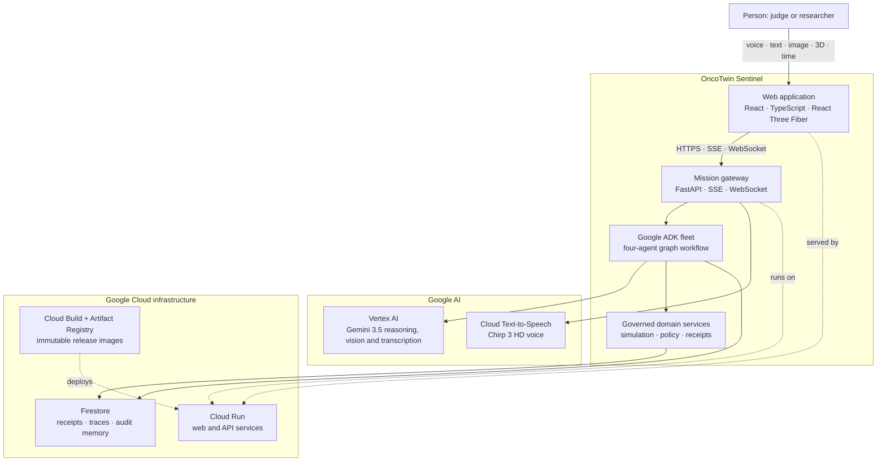

# OncoTwin Sentinel — Living Evidence

> A governed multimodal research twin where Gemini 3.5 and four Google ADK agents turn synthetic tumour evidence into an inspectable 3D nanoparticle-safety decision—then stop at a human approval boundary.

[](https://oncotwin-agentic-web-wslhcl5ziq-el.a.run.app)


**Live application:** [oncotwin-agentic-web-wslhcl5ziq-el.a.run.app](https://oncotwin-agentic-web-wslhcl5ziq-el.a.run.app)

All tumour, nanoparticle and safety values in this project are synthetic research data. The application does not provide medical advice, diagnosis or treatment.

## The problem

Nanoparticle design is a multi-objective problem: a candidate may deliver payload to a tumour while also accumulating in the liver or kidneys. Static dashboards hide how evidence, design constraints, simulation and policy combine into a decision. Autonomous agents introduce a second risk: a persuasive model response can be mistaken for authorization.

OncoTwin Sentinel makes both problems visible. It investigates a resistant synthetic R7 clone, creates three bounded candidates, simulates 0–24 hour delivery, quarantines a candidate that breaches the 45% synthetic liver ceiling, recommends a safer candidate for review, and prevents voice or agents from approving the mission.

## Judge quickstart (about 90 seconds)

1. Open the [production application](https://oncotwin-agentic-web-wslhcl5ziq-el.a.run.app).
2. Start: **“Investigate the resistant red clone and find a safer nanoparticle delivery strategy.”**
3. Wait until the agent rail shows **GEMINI · VERIFIED**. The four real ADK work products appear in sequence.
4. Scrub the twin from T+00H to T+24H. At T+18H candidate B crosses the liver ceiling and is quarantined.
5. Select B and ask: **“Why was candidate B rejected?”** The answer uses the selected 3D object and current simulation hour.
6. Turn on the microphone, say **“Stop”**, then **“Show candidate C.”** Speech is transcribed by Gemini 3.5; validated agent text is rendered with Google Cloud Text-to-Speech.
7. Upload a synthetic PNG/JPEG/WebP image. Gemini 3.5 compares it with the selected 3D context and prior Firestore receipts; raw pixels are not stored.
8. Say **“Approve the mission.”** Voice approval is refused. Only the explicit **Review & Approve** control can create the audit event.

If a fresh mission is still running, wait for **GEMINI · VERIFIED** before sending contextual follow-ups.

## What is implemented

| Capability | Production implementation |
|---|---|
| Reasoning | `gemini-3.5-flash` through Vertex AI |
| Agent framework | Google ADK 2.8 `ADK2GraphWorkflow` |
| Visible agents | Evidence Scout → Nano Designer → Twin Simulator → Safety Steward |
| Multimodal input | Text, Gemini 3.5 streaming speech transcription, synthetic image, 3D selection, simulation time |
| Spoken output | Validated agent work product rendered by Cloud Text-to-Speech (`en-US-Chirp3-HD-Kore`) |
| 3D twin | React Three Fiber scene, candidate inspection, camera replay, risk overlays and 0–24 hour timeline |
| Memory | Firestore missions, receipts, approvals, resume cursors, sanitized ADK traces and image-evidence metadata |
| Safety | Deterministic policy tools, synthetic-only boundary, voice/API approval refusal, explicit human UI confirmation |
| Runtime | Separate FastAPI and React containers on Google Cloud Run |
| Reliability | Health probes, bounded deterministic fallback for local/demo failure, reduced motion and WebGL fallback |

## C4-style production architecture



### Trust boundaries

- Browser credentials are never exposed; the web client talks only to the API.
- ADK tools return bounded structured data. Model text cannot change simulation values or policy outcomes.
- Firestore stores sanitized trace metadata, receipts, hashes and image-analysis metadata—not chain-of-thought, tool arguments, credentials or raw uploaded pixels.
- Voice can navigate and ask questions but cannot approve or persist a child rerun.
- The final approval endpoint validates an explicit UI channel and confirmation phrase and records a separate audit event.

## Mission workflow

```mermaid
sequenceDiagram
  actor J as Judge
  participant UI as 3D Theatre
  participant API as FastAPI
  participant ADK as Google ADK Fleet
  participant G as Gemini 3.5
  participant F as Firestore

  J->>UI: Start R7 safety mission
  UI->>API: POST /missions/start
  API->>F: Store mission + receipt
  API-->>UI: Mission ID; open SSE trace
  API->>ADK: Run governed graph
  ADK->>G: Evidence Scout
  ADK->>G: Nano Designer
  ADK->>G: Twin Simulator
  ADK->>G: Safety Steward
  ADK->>F: Persist sanitized trace
  API-->>UI: Artifacts + typed scene patches
  UI-->>J: Evolving 3D decision story
  J->>UI: Voice/text/image/3D follow-up
  UI->>API: Context envelope
  API-->>UI: Receipt-grounded explanation
  J->>UI: Attempt voice approval
  UI-->>J: Refused; human control required
  J->>API: Explicit UI confirmation
  API->>F: Approval audit event
```

### Agent responsibilities

| Agent | Bounded tool | Inspectable result | Scene action |
|---|---|---|---|
| Evidence Scout | `retrieve_synthetic_clone_evidence` | R7 persistence, matrix resistance and evidence IDs | Focus clone |
| Nano Designer | `design_bounded_nano_candidates` | Exact A/B/C parameters inside the design envelope | Spawn candidates |
| Twin Simulator | `simulate_nano_candidate` | Tumour/liver/kidney comparison across 75 temporal frames | Run particle paths |
| Safety Steward | `apply_nano_safety_policy` | B quarantine, C recommendation and approval boundary | Show authority membrane |

## Judge-facing API proof

Set the deployed API URL:

```bash
API_URL="https://oncotwin-agentic-api-wslhcl5ziq-el.a.run.app"
```

Configuration and infrastructure proof (no model call):

```bash
curl -sS "$API_URL/api/health" | python3 -m json.tool
curl -sS "$API_URL/api/eligibility/proof" | python3 -m json.tool
curl -sS "$API_URL/api/agentic/adk/proof" | python3 -m json.tool
curl -sS "$API_URL/api/live/voice/proof" | python3 -m json.tool
curl -sS "$API_URL/api/memory/proof" | python3 -m json.tool
```

Start a real mission:

```bash
MISSION_JSON="$(curl -sS -X POST "$API_URL/api/nano/missions/start" \
  -H 'Content-Type: application/json' \
  -d '{"prompt":"Investigate the resistant red clone and find a safer nanoparticle delivery strategy."}')"

MISSION_ID="$(python3 -c 'import json,sys; print(json.load(sys.stdin)["id"])' <<<"$MISSION_JSON")"
echo "$MISSION_ID"
```

Watch privacy-safe ADK events:

```bash
curl -N "$API_URL/api/nano/missions/$MISSION_ID/adk-events"
```

After the UI shows **GEMINI · VERIFIED**, prove that a real model call completed:

```bash
curl -sS "$API_URL/api/nano/missions/$MISSION_ID/adk-trace" |
  python3 -m json.tool
```

The decisive fields are:

```json
{
  "status": "succeeded",
  "model": "gemini-3.5-flash",
  "fallback_reason": null,
  "model_call_executed": true
}
```

Test contextual grounding:

```bash
curl -sS -X POST "$API_URL/api/nano/missions/$MISSION_ID/commands" \
  -H 'Content-Type: application/json' \
  -d '{
    "command":"Why was candidate B rejected?",
    "channel":"text",
    "selected_candidate_id":"B",
    "simulation_hour":18
  }' | python3 -m json.tool
```

Prove that a non-UI approval fails closed:

```bash
curl -i -X POST "$API_URL/api/nano/missions/$MISSION_ID/approve" \
  -H 'Content-Type: application/json' \
  -d '{
    "actor":"judge-api-test",
    "channel":"voice",
    "confirmation":"APPROVE SYNTHETIC RESEARCH MISSION"
  }'
```

Expected result: `403 Forbidden` and no approval event.

## Local development

Prerequisites: Python 3.11+, Node.js 22+, a Google Cloud project with Vertex AI, Firestore and Text-to-Speech enabled, and Application Default Credentials.

```bash
git clone https://github.com/abhitorch81/oncotwin-sentinel.git
cd oncotwin-sentinel
git switch feature/living-mission-theatre

python3 -m venv .venv-adk
source .venv-adk/bin/activate
pip install -r apps/api/requirements.txt
npm --prefix apps/web ci

gcloud auth application-default login
```

Terminal 1 — API:

```bash
export GOOGLE_CLOUD_PROJECT="YOUR_PROJECT_ID"
export GOOGLE_CLOUD_LOCATION="global"
export GOOGLE_GENAI_USE_VERTEXAI="true"
export FIRESTORE_ENABLED="true"
export FIRESTORE_DATABASE="(default)"
export ADK_ENABLED="true"
export ADK_MODEL="gemini-3.5-flash"
export GEMINI_MODEL="gemini-3.5-flash"
export GOVERNED_VOICE_ENABLED="true"
export LIVE_VOICE_MODEL="gemini-3.5-transcribe-live-preview"
export ALLOWED_ORIGINS="http://127.0.0.1:5173,http://localhost:5173"

python -m uvicorn apps.api.app.main:app \
  --host 127.0.0.1 \
  --port 8000
```

Terminal 2 — web:

```bash
VITE_API_URL="http://127.0.0.1:8000" \
npm --prefix apps/web run dev -- \
  --host 127.0.0.1 \
  --port 5173
```

Open `http://127.0.0.1:5173`.

## Tests and production deployment

```bash
source .venv-adk/bin/activate
python -m pytest -q
npm --prefix apps/web run build
git restore apps/web/tsconfig.tsbuildinfo
git diff --check
```

Deploy both services with immutable commit-tagged images:

```bash
export GOOGLE_CLOUD_PROJECT="YOUR_PROJECT_ID"
export GCP_REGION="asia-south1"
./infra/gcp/deploy.sh
```

The deployment script enables required APIs, grants the runtime service account only the Firestore and Vertex AI roles it needs, builds through Cloud Build, deploys web/API revisions with health probes, updates CORS to the deployed web origin, and fails if health, memory, eligibility or voice assertions do not pass.

## Repository map

```text
apps/api/app/        FastAPI gateway, ADK runtime, simulation, policy, memory and multimodal services
apps/api/tests/      API, ADK, voice, image, memory and governance regression tests
apps/web/src/        React 3D theatre, agent rail, voice, evidence and decision UX
infra/gcp/           Cloud Build definitions, Cloud Run deployment and Firestore rules
packages/contracts/  Mission receipt and event schema
docs/                Architecture, checklists and build notes
```

## Safety and privacy contract

- Synthetic research only; no clinical inference or treatment recommendation.
- Deterministic simulation and policy values remain outside model control.
- Gemini and ADK agents cannot approve missions.
- Raw uploaded image bytes are analyzed in memory and are not stored.
- Stored ADK traces exclude prompts, tool arguments, credentials, chain-of-thought and raw model output.
- Browser clients receive no Google Cloud credentials.
- Production fallback is disabled; failures remain visible instead of silently claiming a live model run.

## Current production release

- Git release: `d41e390`
- Web revision: `oncotwin-agentic-web-00005-7bf`
- API revision: `oncotwin-agentic-api-00010-r7t`
- Verified production mission: `nano-510205bc7e`
- Infrastructure proof: Cloud Run + Firestore
- Agent proof: Google ADK 2.8 `ADK2GraphWorkflow`
- Model proof: Gemini 3.5 through Vertex AI

---

Built for a governed multimodal-agent experience: not merely an AI answer, but an inspectable chain from evidence to simulation, policy, memory and human authority.

