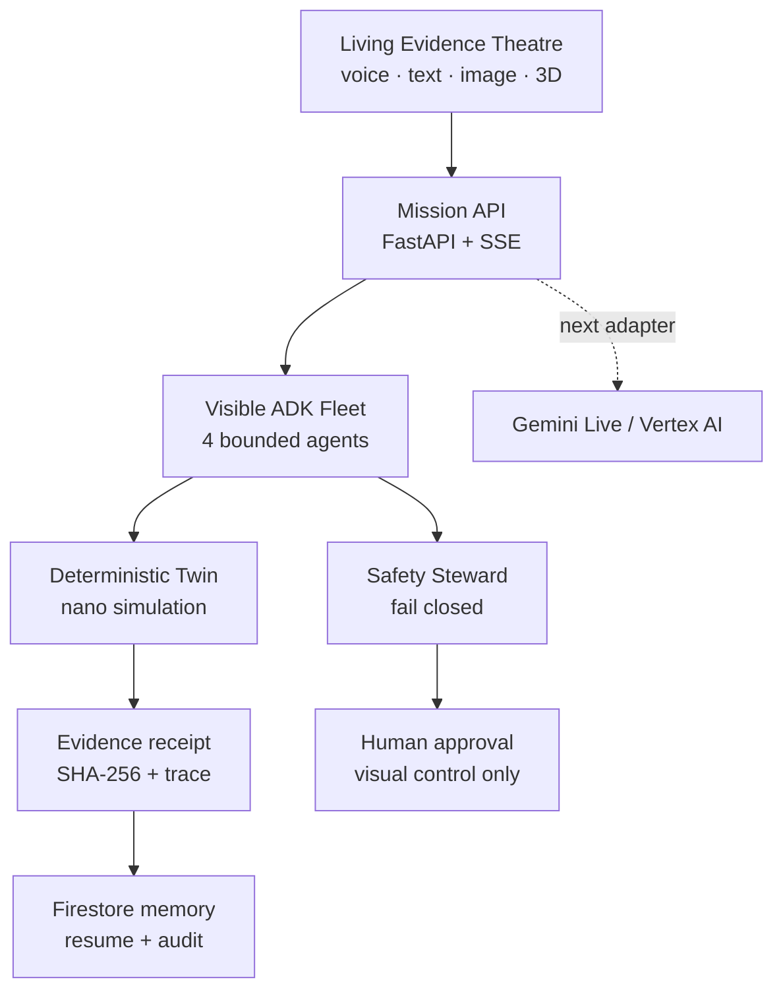

# OncoTwin Sentinel — Living Evidence

OncoTwin Sentinel is a synthetic, research-only agentic oncology digital twin. Its hero mission investigates a resistant red tumour clone, designs three bounded nanoparticle candidates, simulates delivery and off-target accumulation, rejects unsafe research conclusions, renders the evidence in 3D, and stops at an explicit human approval boundary.

This is a clean Google-native Milestone 1 baseline. It intentionally contains no AWS code.

## The demo in one sentence

Say or type **“Investigate the resistant red clone and find a safer nanoparticle delivery strategy”** and watch four understandable agents turn evidence into an auditable 3D decision—without silently crossing the human authority boundary.

## What is implemented

- Four visible agents: Evidence Scout, Nano Designer, Twin Simulator, Safety Steward
- Deterministic three-candidate synthetic nanoparticle simulation
- Tumour delivery versus liver/kidney accumulation comparison
- Candidate rejection and preferred-candidate selection
- SHA-256 evidence receipt and prior-receipt retrieval boundary
- Google Cloud Firestore mission persistence with restart proof and approval audit
- Server-Sent Event trace contract with 3D scene actions
- Fail-closed approval: voice may request, but never grant, approval
- React + TypeScript + React Three Fiber “Living Evidence Theatre”
- Browser speech-to-text fallback, text command, and clickable 3D clone
- FastAPI health, capabilities, architecture proof, mission and approval endpoints
- Cloud Run/Docker foundation and locked-down Firestore rules
- Offline demo fallback for a judge-safe presentation

## Truthful milestone boundary

Google ADK orchestration and production Firestore persistence are implemented behind
explicit feature/configuration gates. Gemini Live native audio, synthetic image comparison,
failed-run continuation from the stored resume cursor, and Cloud Run observability remain
the next adapters; the application does not claim those are complete.

## Architecture



## Local run

Requires Python 3.11+ and Node 22+.

```bash
cp .env.example .env
python3 -m venv .venv
source .venv/bin/activate
pip install -r apps/api/requirements.txt
uvicorn apps.api.app.main:app --reload --port 8000
```

In another terminal:

```bash
cd apps/web
npm install
npm run dev
```

Open `http://localhost:5173`. If the API is unavailable, the interface automatically runs its deterministic judge-demo fallback.

## Verification

```bash
make check
python3 -m json.tool packages/contracts/mission.schema.json >/dev/null
```

## Safety contract

- All medical-looking values are synthetic demonstration data.
- No diagnostic or treatment claim is emitted.
- Candidate safety is a transparent deterministic research heuristic, not a clinical model.
- External mutation is disabled in this milestone.
- Approval validates the channel and exact confirmation, failing closed on voice/API attempts.

## Next build sequence

1. Add interruptible Gemini Live voice as a separate low-latency gateway.
2. Connect failed ADK runs to the persisted resume cursor.
3. Add governed synthetic image comparison and visible provenance.
4. Deploy to Cloud Run with Secret Manager and structured trace logging.
5. Add the Mission Constellation: Biofilm, Hypoxic Core, GBM/BBB, Immune, Antigen Escape, and Longitudinal Adaptation.
