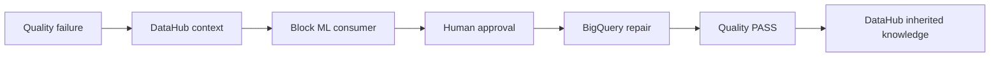
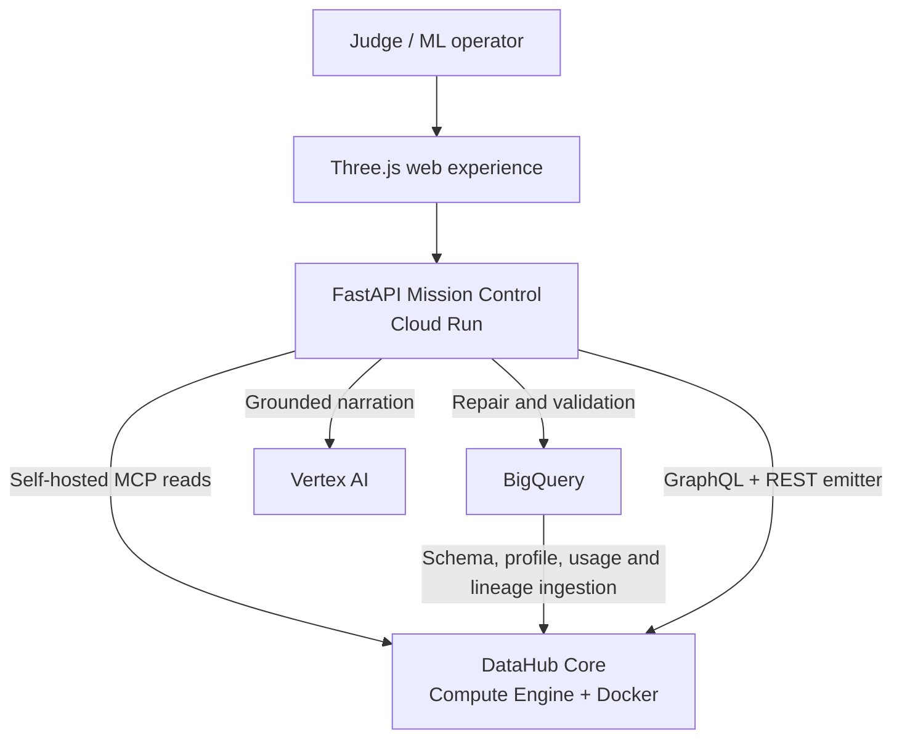

# OncoTwin 3D × DataHub — Cancer Context Mission Control

[](#)
[](https://datahub.com/)
[](https://cloud.google.com/)
[](https://google.github.io/adk-docs/)
[](LICENSE)

**DataHub-grounded cancer-context digital twins that discover risk, block unsafe ML consumption, repair governed data and write auditable knowledge back to the context graph.**

OncoTwin V12.2 is a reproducible hackathon application that makes cancer-data reliability visible. It combines twelve cancer-context digital twins with Google ADK orchestration, Gemini 3.5+, DataHub catalog search, entity context, schema inspection, end-to-end lineage, generating-query evidence, natural-language analytics and human-approved, condition-scoped incident writeback.

> Research demonstration only. The included data is synthetic/de-identified and the application does not provide diagnosis or medical advice.

## Judges — start here

| What to inspect | Link |
|---|---|
| 3-minute validation path | [Judge Quickstart](docs/JUDGE_QUICKSTART.md) |
| Complete system architecture | [C4 architecture and full flow](ONCOTWIN_C4_ARCHITECTURE_V10_1.md) |
| Exact GCP deployment | [Deployment guide](DEPLOYMENT.md) |
| Five-minute presentation | [Demo runbook](DEMO_RUNBOOK.md) |
| Devpost submission copy | [Submission template](docs/DEVPOST_SUBMISSION.md) |
| GitHub publishing process | [Publishing guide](docs/GITHUB_PUBLISHING.md) |

### The undeniable DataHub writeback story

1. **Biomarker Completeness Crisis** creates a real failing BigQuery quality signal and an active incident on `progression_features`.
2. DataHub MCP retrieves the canonical URN, schema, ownership, generating queries and lineage.
3. DataHub proves `progression_scores` is downstream, so ML Guardian blocks consumption.
4. Repair Engineer generates SQL from the cataloged schema and contract.
5. The application pauses until a human supplies the Secret Manager approval value.
6. BigQuery repairs `progression_features`, regenerates `progression_scores` and validates zero NULL signals.
7. Governance Steward resolves the DataHub incident only after validation passes.
8. The agent writes an `AgentRepaired` tag, description, responsible agent, UTC timestamp, job IDs, validation result and SHA-256 receipt back to DataHub.
9. A final MCP read proves that the next person or agent inherits the recovery knowledge.



## Architecture at a glance



The public judge site is served by Cloud Run. DataHub Core runs as Docker containers on a private Compute Engine VM. Cloud Run reaches DataHub GMS over the VPC; judges view the DataHub UI through an IAP tunnel. Tokens and the approval secret are mounted from Secret Manager and never shipped to the browser.

## One-command local evaluation

Local mode is deliberately labelled `DEMO MODE` and performs no external mutations:

```bash
git clone https://github.com/YOUR_GITHUB_USERNAME/oncotwin-datahub.git
cd oncotwin-datahub
chmod +x scripts/*.sh
bash scripts/12_local_demo.sh
```

Open <http://localhost:8080>.

## Complete Google Cloud deployment

The numbered scripts are idempotent where practical and are intended to be run from a Mac or Linux terminal with `gcloud`, `bq`, `curl`, Docker and Python 3 installed.

### 1. Authenticate and select a project

```bash
gcloud auth login
gcloud auth application-default login
gcloud projects list

export GCP_PROJECT_ID="YOUR_PROJECT_ID"
export GCP_REGION="asia-south1"
export GCP_ZONE="asia-south1-a"
export DATAHUB_VM_NAME="oncotwin-datahub"

chmod +x scripts/*.sh
bash scripts/00_check_prerequisites.sh
```

Billing must be enabled on the project.

### 2. Create the GCP foundation

```bash
bash scripts/01_prepare_gcp.sh
```

This enables Cloud Run, Compute Engine, Artifact Registry, Cloud Build, Secret Manager, Vertex AI, BigQuery and VPC Access; creates `oncotwin-net`, `oncotwin-subnet`, the Artifact Registry repository and the `oncotwin-agent` service account.

### 3. Host DataHub with Docker on Compute Engine

```bash
bash scripts/02_create_datahub_vm.sh
```

The startup script installs Docker and runs DataHub Quickstart on an `e2-standard-4` VM with an 80 GB disk and swap. Wait 5–10 minutes, then verify:

```bash
gcloud compute ssh oncotwin-datahub \
  --zone="${GCP_ZONE}" \
  --tunnel-through-iap \
  --command="sudo docker ps"
```

Expected services include DataHub frontend, GMS, actions, MySQL, Kafka and OpenSearch.

### 4. Open the private DataHub UI and create tokens

```bash
bash scripts/11_open_datahub_tunnel.sh
```

Keep that terminal open and browse to <http://localhost:9002>. Create a scoped `oncotwin-agent` token under **Settings → Access Tokens**. Keep a separate admin-capable token/version for approved incident and metadata writes.

In a second terminal:

```bash
export DATAHUB_GMS_URL="http://localhost:8088"
read -s DATAHUB_GMS_TOKEN
export DATAHUB_GMS_TOKEN
```

### 5. Seed BigQuery and store secrets

```bash
bash scripts/03_seed_bigquery.sh

export WRITEBACK_APPROVAL_SECRET="$(openssl rand -hex 24)"
bash scripts/04_create_secrets.sh
```

Store the approval value in a password manager. Never commit it or show it in a recording.

### 6. Ingest and enrich DataHub context

```bash
bash scripts/06_ingest_bigquery.sh
bash scripts/17_bootstrap_datahub_context.sh
```

This emits twelve BigQuery assets plus schemas, profiles, operations, usage, queries, lineage, ownership, tags, domain and machine-readable contracts.

### 7. Install the official DataHub Skills

```bash
bash scripts/15_install_datahub_skills_vm.sh
```

The VM receives Gemini CLI, `uvx` and the official DataHub Skills. Tokens are not copied by the installer.

### 8. Deploy the judge site to Cloud Run

Choose the appropriate secret versions. In the validated hackathon environment, the latest scoped token performs reads and version `1` is the administrator token:

```bash
export DATAHUB_READ_TOKEN_VERSION="latest"
export DATAHUB_ADMIN_TOKEN_VERSION="1"

bash scripts/05_deploy_oncotwin.sh

export APP_URL="$(gcloud run services describe oncotwin-mission-control \
  --region="${GCP_REGION}" \
  --format='value(status.url)')"
```

For a new installation, set `DATAHUB_ADMIN_TOKEN_VERSION` to whichever Secret Manager version contains the admin-capable token.

### 9. Verify the live deployment

```bash
bash scripts/07_smoke_test.sh
bash scripts/14_verify_ui_version.sh
bash scripts/18_verify_all_datahub_conditions.sh \
  | tee ONCOTWIN_ALL_CONDITIONS_PROOF.txt
```

Expected result: `7/7` conditions and `6/6` DataHub reads per condition.

Run the governed writeback proof:

```bash
export WRITEBACK_APPROVAL_SECRET="$(gcloud secrets versions access latest \
  --secret=oncotwin-writeback-approval \
  --project="${GCP_PROJECT_ID}")"

bash scripts/16_verify_live_rl_mission.sh \
  | tee ONCOTWIN_GOVERNED_WRITEBACK_PROOF.txt

unset WRITEBACK_APPROVAL_SECRET
```

### 10. Optional Analytics Agent deployment

```bash
bash scripts/09_create_bigquery_key_secret.sh
bash scripts/10_deploy_analytics_agent.sh
```

This deploys the official DataHub Analytics Agent integration with BigQuery and Gemini. The main governed mission remains functional without this optional container.

### 11. Cost control and cleanup

```bash
bash scripts/08_stop_start.sh stop   # stop DataHub when not demonstrating
bash scripts/08_stop_start.sh start  # start before judging
bash scripts/13_remove_vm_public_ip.sh
```

Cloud Run scales to zero. Stopping the VM stops compute charges, while disk charges continue. Revoke DataHub tokens, remove temporary service-account keys and delete secrets after judging.

## What is genuinely integrated

- **DataHub Core Quickstart** on a Google Compute Engine x86 VM.
- **Self-hosted DataHub MCP Server** launched by the FastAPI agent backend.
- **DataHub Agent Context Kit** for agent-ready catalog tools.
- **Official DataHub Skills** installed on the GCP VM for Gemini CLI (`datahub-search`, `datahub-quality`, `datahub-lineage`, `datahub-enrich`). The production Repair Engineer mirrors the same quality → lineage workflow using live MCP evidence and emits a context fingerprint with every generated artifact.
- **Google Gemini** for grounded narration; Vertex AI credentials are used by the custom agents.
- **Google ADK Fortified Fleet** coordinates EvidenceScout, TwinAnalyst, RepairPlanner and SafetySteward with Gemini 3.5+ through `SequentialAgent`. The fleet is read-first, emits a visible judge trace and cannot approve or mutate external systems. See `docs/GOOGLE_ADK_FLEET.md`.
- **Gemini Live native audio** through a backend-only WebSocket, with visible transcription, barge-in, deterministic Three.js commands and a browser voice fallback. See `docs/GEMINI_LIVE.md`.
- **DataHub Analytics Agent** for natural-language → SQL → chart, context-quality scoring and `/improve-context` writeback.
- **BigQuery** for analysis-ready scRNA summaries; raw matrices can remain in GCS.
- **Governed mutations** using a single-use server-side proposal and a human approval secret.
- **Cloud Run** for the mission-control application and Analytics Agent.
- **Three.js anatomical specimen twin** with locally vendored high-detail GLB lung/heart/liver/kidney meshes, solid tissue lighting, orbit/zoom, selectable lesions, internal scRNA layers and five-stage progression playback.
- **DataHub-to-scene event bridge**: every agent trace includes a `scene_cue`, so MCP search, quality inspection, lineage, grounded analysis and governance visibly change the 3D scene.
- **Twelve replayable RL safety missions**, covering governed data quality, resistance evolution, drift, schema mutation, multi-omics, spatial context, liquid biopsy, bispecifics, cell therapy, vaccines and theranostics. A deterministic tabular Q-learning policy chooses data/ML safety actions; it never recommends treatment.
- **Timestamped evidence replay**: live DataHub MCP results, RL state/action/reward and governance outcomes are persisted as a mission trace and can be replayed without repeating a mutation.
- **Twelve DataHub-native data products**: every mission has a distinct BigQuery table, DataHub URN, owner, tags, contract, schema, upstream lineage and generating-query evidence.
- **Undeniable governed writeback**: the feature-quality mission opens a real DataHub incident, blocks its downstream ML consumer, executes an approval-gated BigQuery repair, validates the contract, resolves the incident, and persists the responsible agent, timestamp, job IDs, `AgentRepaired` tag and SHA-256 audit receipt back into DataHub.
- **Judge-proof receipt**: the Proof Galaxy calls DataHub live and exposes the selected condition, canonical URN, six MCP reads, measured latency, active incidents, the approval boundary and an exportable SHA-256 zero-write JSON receipt.
- **3D Cancer Context Universe**: seven selectable Three.js worlds use distinct visual grammars—biomarker constellation, cell-state evolution, drift wavefront, schema rift, multi-omic phase conflict, schematic protein folding and spatial immune escape.
- **DataHub Causal Observatory**: a thirteen-node spatial lineage organism binds fresh condition-specific MCP proof to live-green edges across all seven cataloged products.

## Seven cancer-context missions

| Mission | DataHub context | RL safety action | Governed outcome |
|---|---|---|---|
| Biomarker Completeness Crisis | Entity health, real schema, lineage, query evidence | Block model | Human-approved BigQuery repair, validation, incident resolution and durable DataHub knowledge writeback |
| Tumour-State Progression Surge | `tumour_state_transitions`: entity, contract, schema, score lineage and query | Flag research review | Human-approved condition incident lifecycle; biology remains simulated |
| Cancer Cohort Drift | `cohort_drift_metrics`: owner, threshold contract, score lineage and query | Block model | Human-approved condition incident lifecycle and retraining gate |
| Genomic Schema Mutation | `genomic_schema_contract_events`: source schema, contract lineage and query | Block consumers | Metadata-aware patch plus approved incident lifecycle |
| Multi-omic Biomarker Discordance | `multi_omic_biomarker_evidence`: RNA/variant/protein schema and lineage | Quarantine biomarker | Approved evidence-reconciliation checkpoint |
| Protein Conformation Evidence Rift | `protein_conformation_states`: source evidence, structure provenance and query | Freeze structure score | Approved provenance checkpoint; schematic state only |
| Tumour Microenvironment Escape | `spatial_microenvironment_states`: cell-cluster lineage, owner and spatial contract | Flag spatial review | Approved spatial-context checkpoint |

The RL state is intentionally operational: data trust, model risk, null rate,
drift, schema compatibility and whether consumers are blocked. Biological
telemetry is synthetic and exists to make the safety system visually legible.

## How judges can verify DataHub is real

Open **Proof Galaxy** and click **Capture live DataHub proof**. In a live Cloud
Run deployment, the proof card must show `LIVE · MCP`, the exact BigQuery asset
URN and `6/6` successful reads. The backend starts the self-hosted DataHub MCP
server and performs fresh `search`, `get_entities`, `list_schema_fields`, upstream
lineage, downstream lineage and `get_dataset_queries` calls. Each result includes its measured latency and a compact
response preview. A read-only GraphQL check adds the current active-incident
count when the admin token is configured.

Click **Export judge proof** to download the complete timestamped JSON receipt.
It records `source: datahub-mcp`, `transport: stdio/self-hosted MCP`, the server
package, proof ID, canonical URN, owner, tags, contract, tool results, incident count, SHA-256 evidence receipt,
`mutation_performed: false` and `human_approval_boundary: true`. Credentials are
never returned to the browser. `DEMO · SIMULATED` is deliberately displayed
when `DEMO_MODE=true`, so a fallback demo cannot be mistaken for live evidence.

Proof Galaxy also makes execution boundaries honest: all seven worlds use live
condition-specific DataHub reads and can execute a narrowly scoped, human-approved
incident lifecycle on their own asset. The biological response, RL policy and 3D
consequence remain research simulations. Protein folding is explicitly schematic,
not a molecular predictor.

## The V10 Cancer Context Universe

Open **Causal Observatory** and choose **Synchronize live DataHub graph**. The
backend captures the same six-read proof bundle and attaches canonical identity,
schema and bidirectional lineage evidence to the spatial graph. Green particles
represent live catalog context. Purple nodes are explicitly labelled conceptual
ML/deployment consumers rather than pretending they were ingested.

Choose one of seven failures and press **Inject incident**. A red counterfactual
wave travels only along the selected causal path until the amber policy membrane
stops unsafe consumption. **Preview recovery** sends a mint wave through the
same path and records `NO WRITE`; the governed mission remains the only route to
an approved mutation. The on-screen truth boundary separates live DataHub
evidence, counterfactual consequence and human policy enforcement.

## How the 3D twin is wired

The scene is intentionally not a pre-rendered video. `GET /api/twin` supplies a safe synthetic scene contract (cell types, lesions, timepoints and relative research signals). The browser renders that contract with Three.js. `POST /api/agents/run` returns the same auditable DataHub trace as before plus one `scene_cue` per step:

| DataHub / agent action | 3D reaction |
|---|---|
| MCP `search` | catalog scan ripples across the tissue |
| MCP `get_entities` | quality warning tints the tissue amber |
| MCP `get_lineage` | propagation routes brighten |
| Agent Context Kit + Gemini | highest-risk visible research signal is focused |
| Governance writeback proposal | auto-rotation locks until human approval |

Judges can drag to orbit, scroll/pinch to zoom, click a white-ring lesion marker, scrub Baseline → Stage IV, or use Rotate, Zoom, Isolate, Cross-section, Layers and Compare. The internal scRNA point layer is deliberately hidden until requested so the default view reads as an anatomical digital specimen rather than a point-cloud demo.

Three.js `0.180.0` and OrbitControls are pinned and vendored in `frontend/assets/vendor/`, including the upstream license. Localhost and Cloud Run therefore render the Cancer Twin, Proof Galaxy and Causal Observatory without fetching a runtime CDN. Each renderer is lazy-loaded so a WebGL/GPU failure cannot disable live DataHub evidence or the other application views.

The V5.3 viewer also vendors anatomical GLBs from the public `yihalem123/Human-Organ3D` repository; its README declares the project MIT-licensed. See `frontend/assets/models/anatomy/SOURCE.md` for the pinned source commit and redistribution note. GLTFLoader and BufferGeometryUtils are vendored from the same pinned Three.js `0.180.0` package as the renderer. Lesion markers are ray-projected onto dominant tissue volumes (excluding vessel/airway meshes where possible), embedded along the hit-face normal, and rendered as softly deformed tissue masses. A local PMREM studio environment adds image-based PBR lighting without an external HDR dependency.

The V5 Cancer Twin was verified in headless Chromium using a real WebGL 2.0 context at 1080×688 canvas resolution. The in-view badge must read `WebGL 2.0 · LOCAL`. A red badge indicates an actionable browser/GPU error rather than silently showing an empty scene.

## Complete judge interface

The mission-control shell intentionally keeps information visible instead of turning the project into a single visualization:

- **Persistent cohort rail:** LUAD, LIHC, PAAD, KIRC, COAD, SKCM and GBM. Selecting one updates incidents, owners, models, driver evidence, cell composition, molecule hypotheses, code generation and graph labels.
- **Live Mission:** six-agent context theatre, clickable inspector, MCP evidence, elapsed time, grounded answer and guarded single-use writeback.
- **Cancer Twin:** interactive Three.js progression scene with DataHub-to-scene cues.
- **scRNA:** interactive UMAP-like cell space, gene programs, cluster counts and schema evidence.
- **Causal Observatory:** spatialized DataHub lineage, live proof synchronization, seven incident injections, policy membrane and counterfactual recovery.
- **Proof Galaxy:** an interactive 3D DataHub core orbited by seven cancer-context worlds, plus live MCP evidence capture and JSON export.
- **Generated Fix:** cohort-aware dbt, Airflow and ingestion artifacts that can be downloaded and reviewed before writeback.
- **Persistent intelligence rail:** trust score, current incident, DataHub identity, drivers, scRNA composition, RDKit molecule hypotheses and an explicit inventory of DataHub utilities.

## Judge story

1. Open Proof Galaxy, capture each condition and show `LIVE · MCP`, its exact URN, six timed reads and zero writes.
2. Export the JSON receipt, then click the seven 3D condition worlds.
3. Ask which cancer progression assets are trustworthy.
4. Watch the Catalog Scout call DataHub `search`.
5. Watch Quality Sentinel inspect schema, ownership and health context.
6. Watch Lineage Guardian trace raw scRNA → features → model → OncoTwin.
7. Read Gemini's evidence-grounded answer with a DataHub URN.
8. Open Repair Engineer and show that its artifact was generated from the returned schema + lineage context fingerprint.
9. See Governance Steward stop at a mutation boundary, then approve once.
10. Optionally open Cancer Analytics Copilot, inspect generated SQL/chart and run `/improve-context` with approval when the Analytics Agent is deployed.

## Repository map

```text
backend/                  FastAPI, MCP adapter, Gemini narrator, guarded agents
frontend/                 Interactive judge mission control and scRNA twin
data/                     Synthetic BigQuery demonstration schema
ingestion/                DataHub BigQuery ingestion recipe
analytics-agent/          Official Analytics Agent Cloud Run wrapper/config
scripts/                  Numbered provisioning and deployment commands
docs/JUDGE_QUICKSTART.md   Three-minute jury validation path
docs/DEVPOST_SUBMISSION.md Ready-to-adapt challenge submission copy
docs/GITHUB_PUBLISHING.md Secure GitHub publication instructions
ONCOTWIN_C4_ARCHITECTURE_V10_1.md Complete C4 and end-to-end flow
DEPLOYMENT.md             Exact end-to-end GCP instructions
DEMO_RUNBOOK.md           Five-minute judge presentation script
```

## Run locally in safe demo mode

```bash
git clone https://github.com/YOUR_GITHUB_USERNAME/oncotwin-datahub.git
cd oncotwin-datahub
chmod +x scripts/*.sh
bash scripts/12_local_demo.sh
```

Open <http://localhost:8080>. Demo mode simulates DataHub evidence but preserves the complete interaction and approval flow. It is visibly labelled `DEMO MODE`.

If an older OncoTwin process is already using port 8080, follow [START_HERE_V4.md](START_HERE_V4.md) and launch the current interface on port 8081.

## Run with live DataHub

Follow [DEPLOYMENT.md](DEPLOYMENT.md) from step 1. A live deployment displays `LIVE DATAHUB` and invokes the official `mcp-server-datahub` process.

## Credentials

| Secret | Used by | Storage |
|---|---|---|
| `DATAHUB_GMS_TOKEN` | MCP, Agent Context Kit, Analytics Agent | Secret Manager |
| `DATAHUB_ADMIN_TOKEN` | Server-only GraphQL incident resolution | Secret Manager |
| Vertex AI identity | Custom Gemini agents | Cloud Run service account / ADC |
| `GOOGLE_API_KEY` | Unmodified Analytics Agent Google provider | Secret Manager |
| `WRITEBACK_APPROVAL_SECRET` | Human mutation approval | Secret Manager + judge operator |

No OpenAI key is required.
